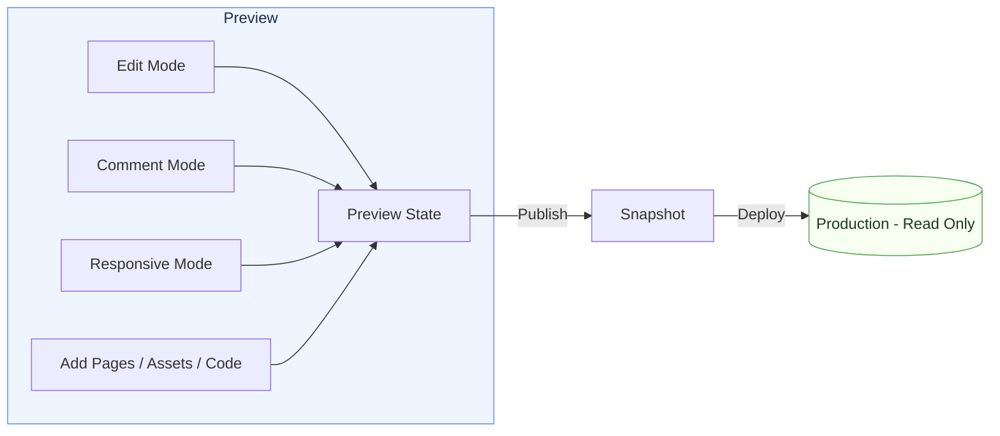

# Preview

The **Preview** is your workspace for building and experimenting with your site.
Changes show up instantly here, while your published site stays safe and unchanged.

## Why use Preview?

<Columns cols={2}>
  <Card title="Safe by design" icon="shield">
    Every time you publish, Fimo saves a read-only snapshot of your site.
    Your live site is never affected until you deploy again.
  </Card>

  <Card title="Live collaboration" icon="users">
    Work together in real time. Teammates can edit, style, and comment inside Preview.
  </Card>

  <Card title="Instant updates" icon="bolt">
    Edit content, swap assets, or add pages, and see the result right away.
  </Card>

  <Card title="Flexible editing" icon="palette">
    Use AI for quick changes or adjust details with the style and content editors.
  </Card>
</Columns>

## Preview vs Production

<Tip>
Preview looks like your site, but it is private to your team. Production is the public version that visitors see.
</Tip>

<Columns cols={2}>
  <Card title="Preview" icon="eye">
    <ul>
      <li>Private to your team</li>
      <li>Live updates as you edit</li>
      <li>Safe sandbox for experiments</li>
      <li>Ideal for reviews and QA</li>
    </ul>
  </Card>

  <Card title="Production" icon="globe">
    <ul>
      <li>Public and SEO-visible</li>
      <li>Read-only snapshot from last publish</li>
      <li>No changes until you publish again</li>
      <li>Optimized and stable for visitors</li>
    </ul>
  </Card>
</Columns>

<Note>
Publishing creates a read-only snapshot of your website. Production remains unchanged until you publish the latest Preview state.
</Note>

## Workflow at a glance

<Steps>
  <Step title="Make changes in Preview">
    Use Edit mode to update content and styles. Add pages and assets. Collaborate with comments.
  </Step>
  <Step title="Review together">
    Stakeholders review in real time. Resolve comments and finalize changes.
  </Step>
  <Step title="Publish to Production">
    Publish when ready. Fimo deploys a new read-only snapshot as your live site.
  </Step>
</Steps>

## Visual diagram

## What’s next?

Preview includes three modes to refine your site:

<Columns cols={3}>
  <Card
    title="Edit Mode"
    icon="pen-to-square"
    href="/preview/edit"
  >
    Change content and styles directly in your site.
  </Card>

  <Card
    title="Comment Mode"
    icon="comment"
    href="/preview/comment"
  >
    Leave feedback and collaborate with your team.
  </Card>

  <Card
    title="Responsive Mode"
    icon="mobile-screen"
    href="/preview/responsive"
  >
    Test your site across different screen sizes.
  </Card>
</Columns>
